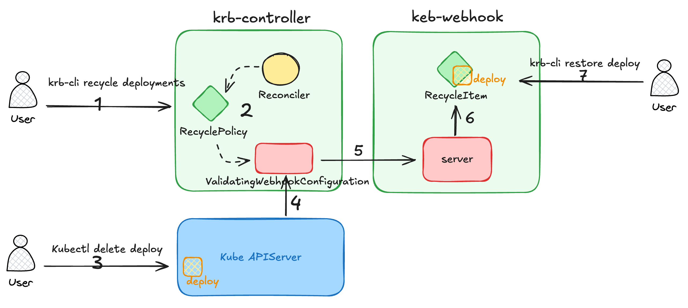

# kube-recycle-bin

[English](README.md) | 简体中文

kube-recycle-bin(krb) 是一个 Kubernetes 资源回收站，它可以做到自动回收，快速恢复已删除的资源。

> 在 Kubernetes 中，资源的删除是不可逆的操作，不可否认，存在像 velero 或 etcd 备份/恢复等方式可以帮助我们找回已删除的资源。
> 但是，会不会在实际场景下你会觉得：杀鸡焉用宰牛刀？
>
> 那么试试 kube-recycle-bin 吧！

## 功能特性

既然是回收站，那么当然它的主要功能就是：

1. 回收：支持回收所有 Kubernetes 资源类型，支持指定命令空间
2. 还原：百分百还原已回收的资源

## 原理



1. 使用 `krb-cli recycle` 命令创建 `RecyclePolicy` 资源，指定需要回收的资源类型和命名空间;
2. `krb-controller` 监听 `RecyclePolicy` 资源的创建、更新和删除，自动同步创建、更新和删除对应的 `ValidatingWebhookConfiguration` 资源;
3. `kube-apiserver` 接收到指定资源的删除请求，通过 `ValidatingWebhookConfiguration` 将请求转发到 `krb-webhook`;
4. `krb-webhook` 解析请求，将删除的资源（JSON 格式）存储到一个新的 `RecycleItem` 资源对象并创建，完成资源的回收;
5. 使用 `krb-cli restore` 命令还原已回收的资源，完成资源的还原后，自动删除 `RecycleItem` 资源对象。

## 部署

1. 安装 CRDs

```bash
kubectl apply -f https://raw.githubusercontent.com/ketches/kube-recycle-bin/master/manifests/crds.yaml   
```

2. 部署 `krb-controller` 和 `krb-webhook`

```bash
kubectl apply -f https://raw.githubusercontent.com/ketches/kube-recycle-bin/master/manifests/deploy.yaml    
```

## 安装 CLI

多种安装方式可供选择：

1. 使用 `go install` 命令安装：

```bash
go install github.com/ketches/kube-recycle-bin/cmd/krb-cli@latest
```

2. 使用脚本(适用于 Linux 和 MacOS)：

```bash
curl -sSL https://github.com/ketches/kube-recycle-bin/raw/master/install_cli.sh | sh
```

3. 从 [Release](https://github.com/ketches/kube-recycle-bin/releases) 页面下载对应操作系统的二进制文件，
   解压后将 `krb-cli` 移动到 `$PATH` 目录下。

4. 从源码安装：

```bash
git clone https://github.com/ketches/kube-recycle-bin.git
cd kube-recycle-bin
make install
```

## 使用指南

Note: 前提是 `krb-controller` 和 `krb-webhook` 已经部署成功。

场景：自动回收 `dev`, `prod` 命名空间下删除的 `Deployment`, `StatefulSet` 和 `Service` 资源。

1. 创建回收策略

```bash
# 创建回收策略
krb-cli recycle deployments statefulsets services -n dev,prod

# 查看创建的回收策略
kubectl get rp
```

创建回收策略后，`krb-controller` 会自动创建 `validatingwebhookconfigurations`

2. 还原已回收的资源

```bash
# 首先创建测试资源
kubectl create deployment krb-test-nginx-deploy --image=nginx --replicas=0 -n dev
kubectl expose deployment krb-test-nginx-deploy --name krb-test-nginx-svc --port=80 --target-port=80 -n dev

# 删除资源
kubectl delete deploy krb-test-nginx-deploy -n dev
kubectl delete svc krb-test-nginx-svc -n dev

# 查看回收站，执行以下命令可以获取已删除的资源，说明回收策略已经生效
krb-cli get ri

# 还原资源，根据以上命令获取到的回收站资源名称
krb-cli restore krb-test-nginx-deploy-skk5c89b krb-test-nginx-svc-txv4vj6v

# 查看还原的资源
kubectl get deploy krb-test-nginx-deploy -n dev
kubectl get svc krb-test-nginx-svc -n dev
```
